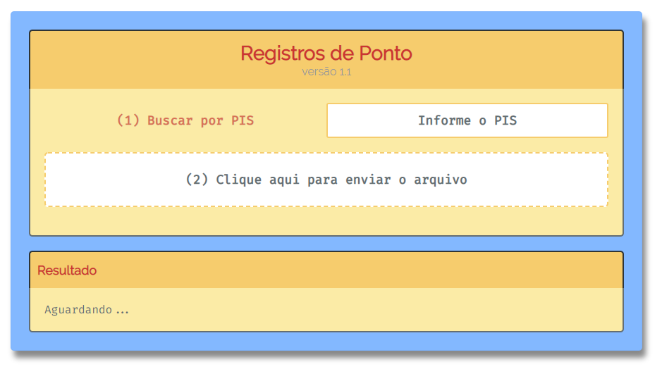
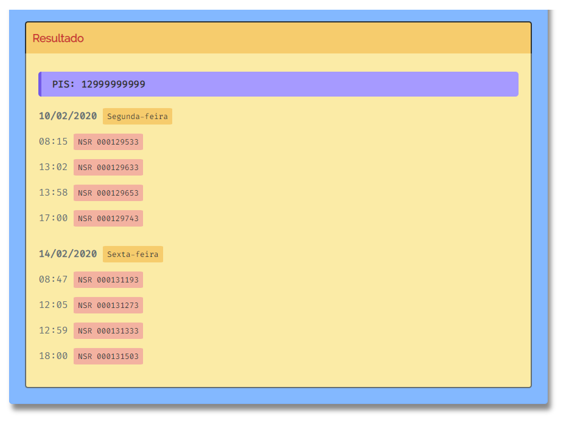

# Registro de Ponto

Para quem faz marcação de ponto usando relógio de ponto é muito comum perder o ticket ou não se lembrar se fez todas as marcações durante o dia. 

Para quem tem acesso ao arquivo de dados enviado ao Recursos Humanos, temos a opção de filtrar todas as marcações de ponto contidas no arquivo ou buscar por um PIS especifico.

## Projeto

Se informar um número de PIS a busca será filtrada, caso não informe um número todos os PIS contidos no arquivo de dados serão exibidos. Neste projeto usei um arquivo de dados do relógio da marca Hexa.

## Resultado

O resultado exibe o número de PIS, e separa os registros por grupos em encabeçado por data.

# Funcionalidades

- [x] Busca por PIS especifico;
- [x] Separar por data;
- [x] Exibe todos os PIS do arquivo;
- [x] Mudança de Layout;
- [x] Validar número de PIS;
- [x] Validar arquivo de Dados;

